# Castle Bridge

**Castle Bridge** is an adventure sword fighting multiplayer game that takes place in the medieval era.
Battles with no mercy, and too many wars between kingdoms.
Only the strongest team may stand a chance of winning the battle.

   

---

## How to play?

### Teams

The game is divided into two groups - red and yellow.
The goal of each team is to invade the opposing team's palace, steal three diamonds from it and bring them to your palace before the opposing team.

<table border="1" cellspacing="0">
 <tr>
  <th>Red</th>
  <th>Yellow</th>
 </tr>
 <tr>
  <td>
   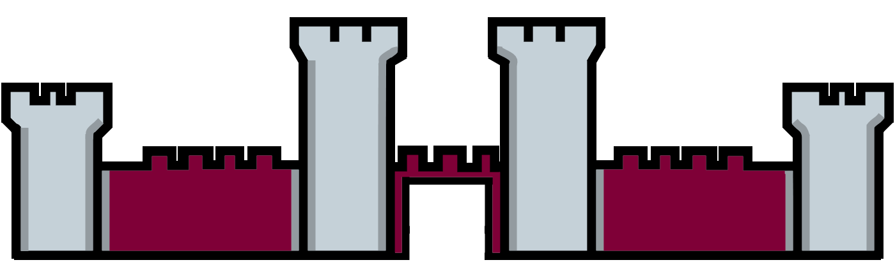
  </td>
  <td>
   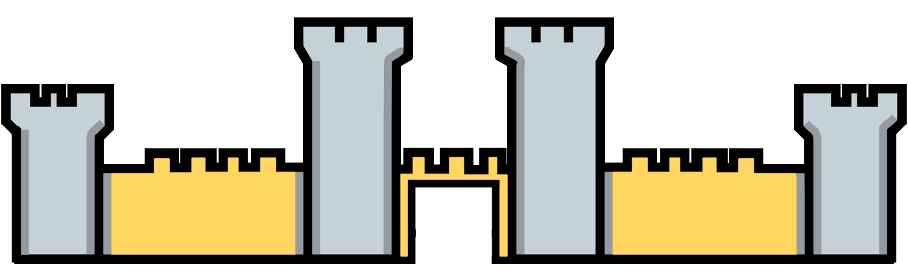
  </td>
 </tr>
</table>

### Characters

Each group has three characters:

1. **Archer**
2. **Knight**
3. **Mage**

Each character has unique attacks and a different appearance and a different strategy.
The characters must be used wisely, the strategy is what will determine the end of the battle.

<table border="1" cellspacing="0">
 <tr>
  <th>Character</th>
  <th>Red Team</th>
  <th>Yellow Team</th>
 </tr>
 <tr>
  <td>Archer</td>
  <td>
   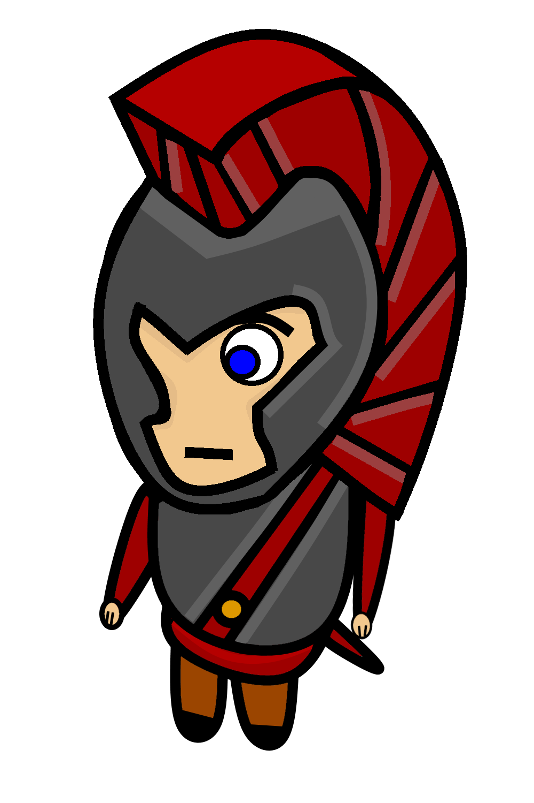
  </td>
  <td>
   
  </td>
 </tr>
 <tr>
  <td>Knight</td>
  <td>
   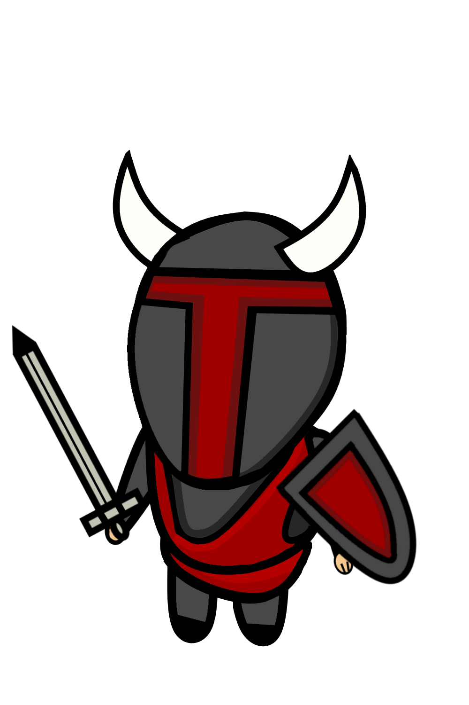
  </td>
  <td>
   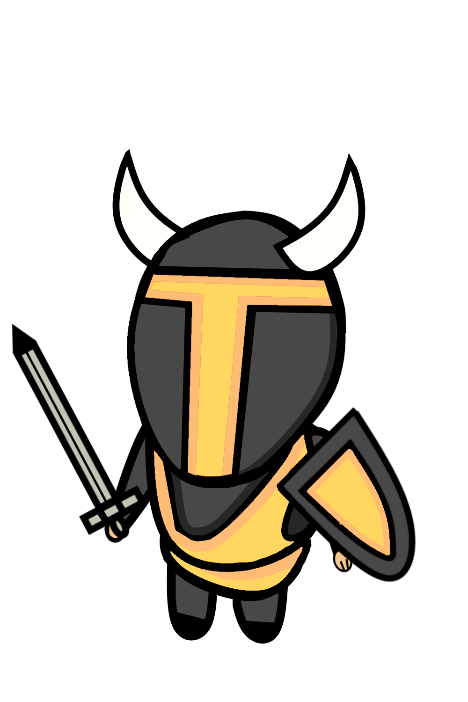
  </td>
 </tr>
 <tr>
  <td>Mage</td>
  <td>
   
  </td>
  <td>
   
  </td>
 </tr>
</table>

### Diamonds

Three diamonds per group. The first team to steal the diamonds and bring them to their destination wins.

<table border="1" cellspacing="0">
 <tr>
  <th>Red Diamond</th>
  <th>Yellow Diamond</th>
 </tr>
 <tr>
  <td>
   
  </td>
  <td>
   
  </td>
 </tr>
</table>

### Gallery

<table border="1" cellspacing="0">
 <tr>
  <td>
   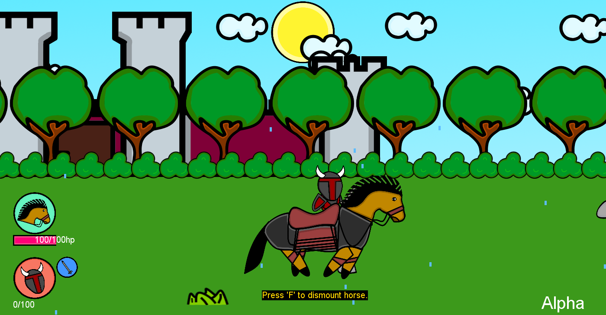
  </td>
  <td>
   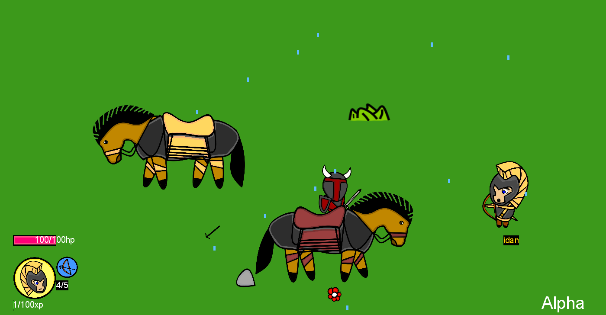
  </td>
   <td>
   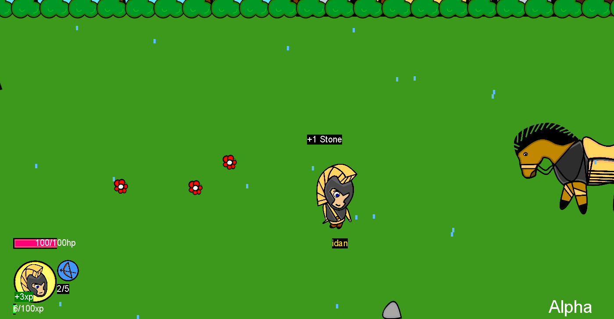
  </td>
 </tr>
 <tr>
  <td>
   
  </td>
  <td>
   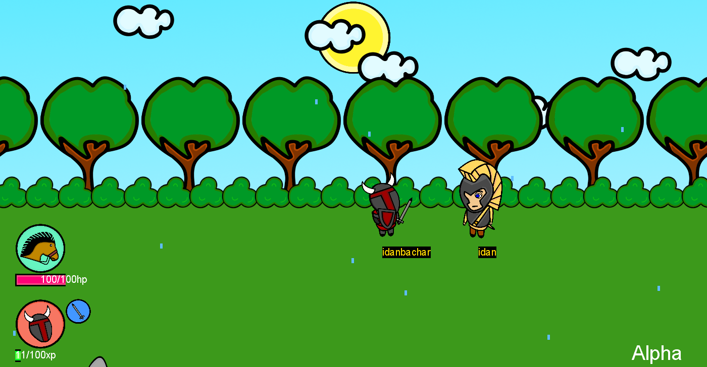
  </td>
   <td>
   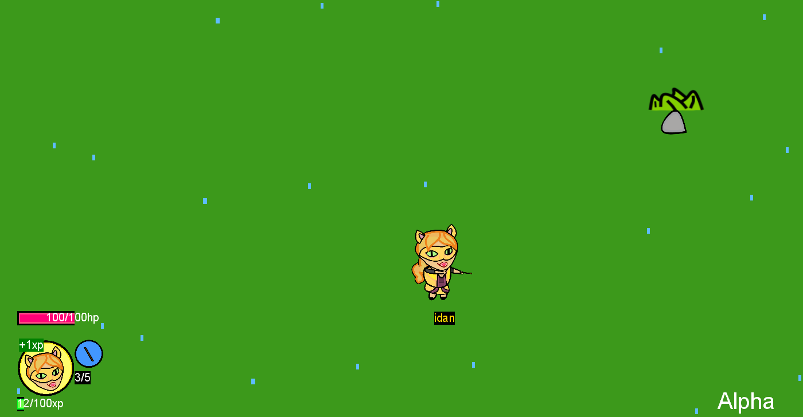
  </td>
 </tr>
 <tr>
  <td>
   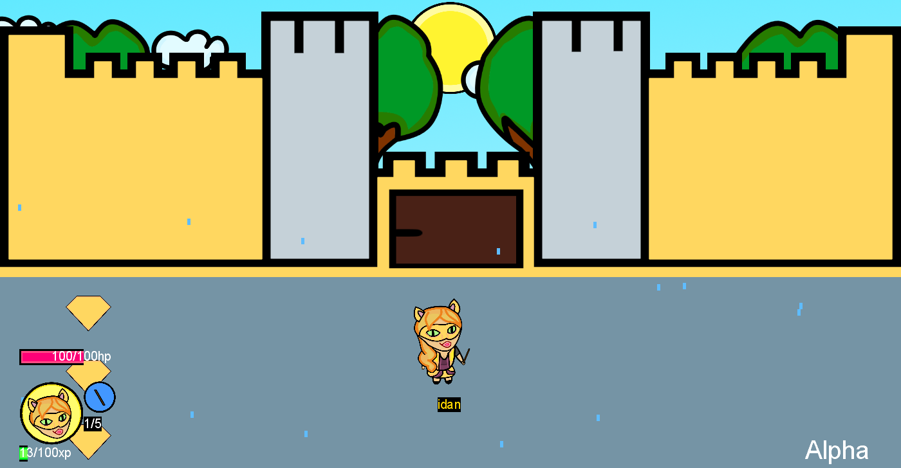
  </td>
 </tr>
</table>
